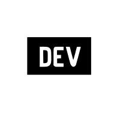

<h1 align="center">Hi, I'm <a href="https://github.com/iwansuryaningrat">Iwan Suryaningrat</a></h1>

<h3 align="center">I'm a passionate Back-End Engineer from Indonesia.</h3>

        
        
        

 

## 🙋‍♂️ About Me

- 👀 I’m interested in Backend Engineer.
- 🌱 I’m currently learning at Diponegoro University, majoring in Informatics
- 🏢 I'm a Backend Developer at <a href="https://youapp.ai/">**YouApp**</a>.
- 💻 I'm also a freelancer for website development
- 💞️ I’m looking to collaborate on to improve my skills
- 📫 You can contact me via Gmail at <a href="mailto:iwan.suryaningrat28@gmail.com?">iwan.suryaningrat28@gmail.com</a>
   

## 🚀 Languages and Tools:

#### 1. Programming

 
    <!-- HTML -->
    
    <!-- CSS -->
    
    <!-- JavaScript -->
    
    <!-- TypeScript -->
    
    <!-- JSON -->
    
    <!-- Node.js -->
    
    <!-- PHP -->
    
    <!-- Golang -->
    
    <!-- Python -->
    

#### 2. Framework

    <!-- Bootstrap -->
     
    <!-- JQuery -->
     
    <!-- ExpressJS -->
    
    <!-- NestJS -->
    
    <!-- CodeIgniter -->
    
    <!-- Laravel -->
    

#### 3. Database

 
    <!-- MySQL -->
    
    <!-- PostgreSQL -->
    
    <!-- MongoDB -->
    

#### 4. Message Broker

    <!-- Rabbit MQ -->
    

##### 5. Cloud & DevOps

    <!-- AWS -->
    
    <!-- Digital Ocean -->
    
    <!-- Docker -->
     
    <!-- Kubernetes -->
     
    <!-- Heroku -->
    
    <!-- Vercel -->
    
    <!-- NGINX -->
    

#### 6. Tools

    <!-- VS Code -->
    
    <!-- Git -->
     
    <!-- GitHub -->
     
    <!-- BitBucket -->
     
    <!-- GitLab -->
     
    <!-- NPM -->
    
    <!-- YARN -->
    
    <!-- Composer -->
    
    <!-- XAMPP -->
    
    <!-- Postman -->
    
    <!-- Figma -->
    

#### 7. Operating System

    <!-- Windows -->
    
    <!-- Linux -->
    
    <!-- Ubuntu -->
    

## 📊 My Github Stats

 

<b>Note:</b> Top languages is <b>only a metric</b> of the languages my <b>public code</b> consists of and <b>doesn't reflect</b> experience or <b>skill level</b>.

 
 

## Connect with me:

## BADGE

